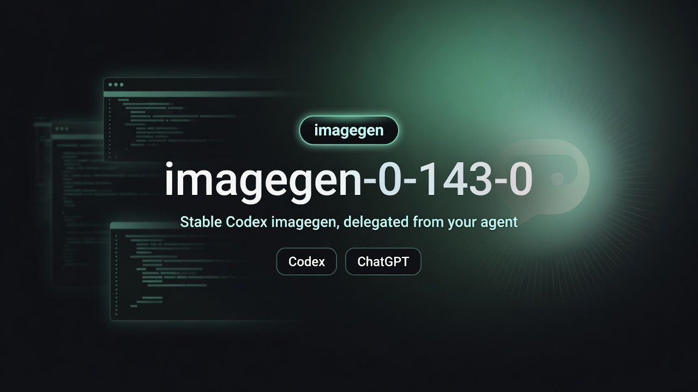

# imagegen-0-143-0

<p align="center">
  <strong>Stable Codex imagegen, delegated from your agent.</strong>
</p>

<p align="center">
  <a href="README-zh.md">繁體中文</a> ·
  <a href="skills/imagegen-0-143-0">Browse skill</a>
</p>



This skill pins image generation and editing to `@openai/codex@0.143.0`. Your coding agent loads `$imagegen-0-143-0`, then delegates the actual image work to that fixed Codex path so results stay repeatable across sessions.

Works with **Codex**, **Claude Code**, and **Grok**.

## Why pin to 0.143.0

Latest Codex image paths can fail with:

```text
image generation failed: network error: error sending request for url
(https://chatgpt.com/backend-api/codex/images/generations)
```

This skill delegates image work to a child process pinned to `@openai/codex@0.143.0` so prompts stay verbatim, inputs use absolute `-i` paths, and the output path is always explicit.

If you still see that network error, check connectivity, VPN/proxy, firewall, and that the authenticated Codex session can reach `chatgpt.com`.

## Install

Copy `skills/imagegen-0-143-0` into the skills directory your agent loads:

| Agent | Personal (all projects) | Project-only |
| --- | --- | --- |
| Codex | `~/.codex/skills/` | project skills path used by your Codex loader |
| Claude Code | `~/.claude/skills/` | `.claude/skills/` |
| Grok | `~/.grok/skills/` or `~/.agents/skills/` | `.grok/skills/` |

```bash
# From this repo root
cp -R skills/imagegen-0-143-0 ~/.claude/skills/imagegen-0-143-0   # Claude Code
cp -R skills/imagegen-0-143-0 ~/.grok/skills/imagegen-0-143-0     # Grok
cp -R skills/imagegen-0-143-0 ~/.agents/skills/imagegen-0-143-0   # shared / multi-agent
cp -R skills/imagegen-0-143-0 ~/.codex/skills/imagegen-0-143-0    # Codex
```

**Prerequisite:** an authenticated Codex / ChatGPT session so the pinned CLI can run imagegen.

## Use with coding agents

Type a normal chat request and name the skill. The agent loads `$imagegen-0-143-0` and runs the pinned workflow for you.

### Codex

```text
Use $imagegen-0-143-0 to generate a polished marketing image of Hong Kong
Victoria Harbour at golden hour. Save it to ./generated.
```

```text
Use $imagegen-0-143-0 to edit /absolute/path/to/product.png: replace the
background with a clean studio setting. Keep product shape and camera angle.
Save to ./generated.
```

### Claude Code

Install under `~/.claude/skills/` or `.claude/skills/`, then:

```text
Use the imagegen-0-143-0 skill to generate a premium product launch hero image
for a modern AI automation platform. Clean professional workspace, subtle screen
glow, room for a website headline. Save to ./generated.
```

```text
$imagegen-0-143-0 — edit ./assets/product.png, studio background, keep the
product unchanged. Save to ./generated.
```

### Grok

Install under `~/.grok/skills/` or `~/.agents/skills/` (or project `.grok/skills/`). Invoke with `$imagegen-0-143-0` or pick the skill from `/skills`:

```text
Use $imagegen-0-143-0 to generate a website hero. Style reference:
./refs/style.jpg. Layout reference: ./refs/layout.png. Same mood and composition,
do not copy the references. Save to ./generated.
```

```text
$imagegen-0-143-0 generate a photorealistic desk setup for a SaaS landing page,
soft morning light. Save absolute path when done.
```

## Prompt patterns

Same wording works across agents. Prefer absolute paths for local images.

**Generate**
```text
Use $imagegen-0-143-0 to generate <your image prompt>. Save it to ./generated.
```

**Edit**
```text
Use $imagegen-0-143-0 to edit /absolute/path/to/source.png: <edit instructions>.
Save to ./generated.
```

**Reference-guided**
```text
Use $imagegen-0-143-0 with /absolute/path/to/style.jpg and
/absolute/path/to/layout.png as references. Generate <your image prompt>.
Do not copy the references. Save to ./generated.
```

## Rules

- Do not rewrite, translate, or “improve” the user’s image prompt unless asked
- File mapping and save path belong in execution instructions, not the image prompt
- Default save directory: `./generated` when the user does not specify one
- Report the final absolute output path

Internal CLI details (for skill authors): [skills/imagegen-0-143-0/references/usage.md](skills/imagegen-0-143-0/references/usage.md)
